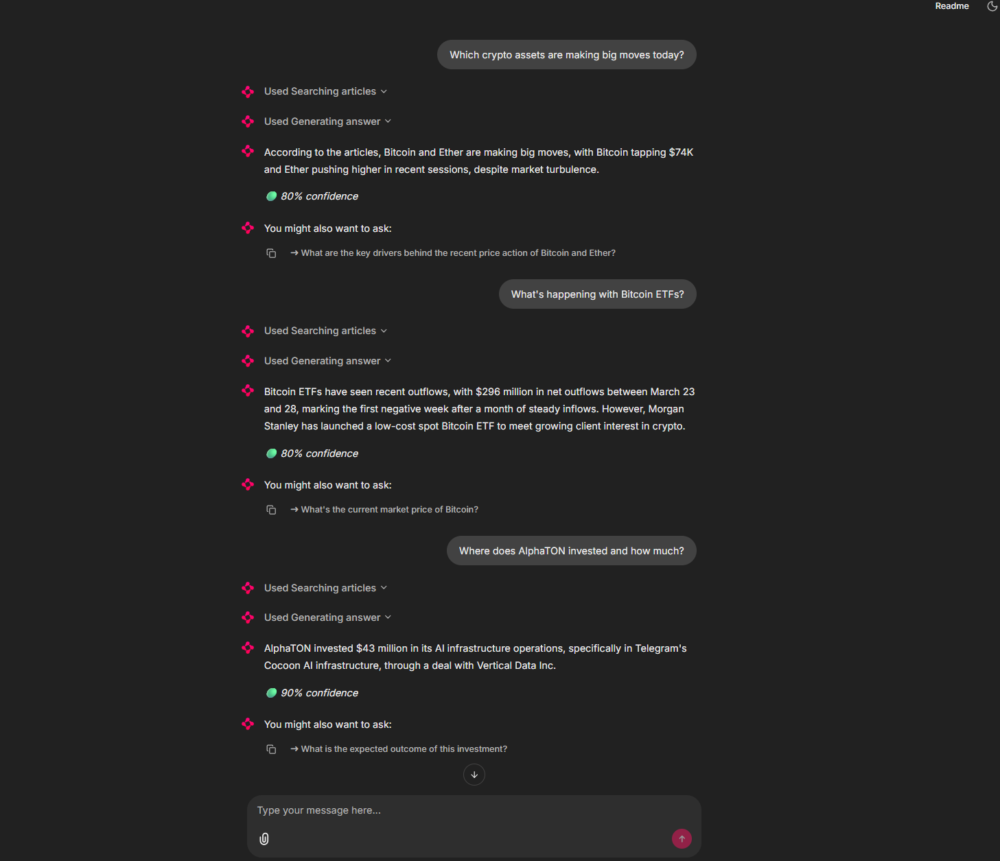

# Crypto News Intelligence System

> Production-grade RAG system that answers questions about live crypto markets using hybrid search, cross-encoder reranking, time-aware freshness scoring, and structured LLM output.


---

## Live Demo

> Ask the chatbot questions like:
> - *"Where did AlphaTON invest and how much?"*
> - *"What is driving the BTC rally this week?"*
> - *"What does the SEC say about crypto oversight?"*



---

## Architecture

```
MongoDB (raw articles)
        │
        ▼
┌─────────────────────────────────────────────────────────────────┐
│  COLLECTOR                                                      │
│  HTML cleaning · date normalisation · tag parsing               │
└────────────────────────────┬────────────────────────────────────┘
                             │ clean CSV
                             ▼
┌─────────────────────────────────────────────────────────────────┐
│  INGESTION                                                      │
│  RecursiveCharacterTextSplitter (512 tokens, 64 overlap)        │
│  → all-MiniLM-L6-v2 dense embeddings                            │
│  → BM25 sparse encoding                                         │
│  → Pinecone upsert (dotproduct, hybrid)                         │
└────────────────────────────┬────────────────────────────────────┘
                             │ vectors in Pinecone
                             ▼
┌─────────────────────────────────────────────────────────────────┐
│  RETRIEVAL                                                      │
│  PineconeHybridSearchRetriever (alpha=0.5, top_k=20)            │
│  → CrossEncoder reranking (ms-marco-MiniLM-L-6-v2)              │
│  → Freshness decay  exp(-λ × age_days)                          │
│  → Score blend  (1-w)·sigmoid(CE) + w·freshness                 │
└────────────────────────────┬────────────────────────────────────┘
                             │ top-5 ScoredChunks
                             ▼
┌─────────────────────────────────────────────────────────────────┐
│  LLM LAYER                                                      │
│  ChatGroq (LLaMA 3.3 70B) · with_structured_output              │
│  → Pydantic RAGResponse (answer · sources · confidence)         │
└────────────────────────────┬────────────────────────────────────┘
                             │ structured JSON
                             ▼
                    Chainlit Chatbot UI
                    LangSmith Monitoring
```

---

## Tech Stack

| Layer | Technology | Purpose |
|---|---|---|
| Data store | MongoDB | Raw article storage |
| Vector DB | Pinecone Serverless | Hybrid dense + sparse vector search |
| Embeddings | `all-MiniLM-L6-v2` | 384-dim dense vectors |
| Sparse encoding | BM25 (pinecone-text) | Keyword matching |
| Reranking | `ms-marco-MiniLM-L-6-v2` | Cross-encoder relevance scoring |
| LLM | LLaMA 3.3 70B via Groq | Fast structured inference |
| Orchestration | LangChain | Chain composition + retriever abstraction |
| Chatbot UI | Chainlit | Conversational frontend with source citations |
| Monitoring | LangSmith | Trace logging, latency, token usage |
| Evaluation | RAGAS | Faithfulness, relevancy, precision, recall |
| HTML parsing | BeautifulSoup4 | Article content extraction |

---

## Project Structure

```
crypto_rag/
│
├── collector/
│   └── mongo_collector.py      # MongoDB → HTML cleaning → normalised CSV
│
├── src/ingestion/
│   ├── chunker.py              # RecursiveCharacterTextSplitter + metadata builder
│   ├── embedder.py             # HuggingFace dense embeddings + batch retry
│   ├── vector_store.py         # Pinecone upsert, BM25 fitting, hybrid search
│   └── pipeline.py             # Single entry point: chunk → embed → upsert
│
├── src/retrieval/
│   └── retriever.py            # Hybrid search → cross-encoder → freshness blend
│
├── eval/
│   ├── dataset.py              # 25 hand-curated Q&A pairs across 8 topic categories
│   ├── run_eval.py             # Runs full pipeline on eval dataset
│   └── evaluate.py             # RAGAS scoring + LangSmith logging
│
├── app.py                      # Chainlit chatbot — starters, sources, follow-up actions
├── llm_client.py               # ChatGroq chain + Pydantic RAGResponse schema
├── chainlit.toml               # UI configuration
├── bm25_encoder.json           # Fitted BM25 model (generated at first ingestion run)
└── .env                        # API keys and config
```

---

## Pipeline Overview

### 1. Data Collection (`collector/`)

Extract article data from the top crypto platform theblock.co API, normalizing the payload into a consistent internal shape, and storing the raw article record in MongoDB for downstream use in the RAG pipeline.

The raw ingestion layer creates a clean boundary between source acquisition and later pipeline stages. Downstream components can work with a consistent raw article collection in MongoDB instead of depending directly on the source API, pagination rules, or response structure. That separation makes the system easier to operate, replay, and extend.

Raw articles are fetched from MongoDB and preprocessed before ingestion:

- **HTML extraction** — BeautifulSoup parses `<p>` tags and strips boilerplate text
- **Date normalisation** — all `published_at` values are coerced to UTC ISO-8601
- **Tag parsing** — handles stringified Python lists (`"['bitcoin', 'defi']"`), comma strings, and character-split corruption
- **Content guard** — articles shorter than 50 characters are skipped at source

Output is a clean CSV with consistent schema: `article_id`, `title`, `url`, `slug`, `tags`, `published_at`, `content`.

---

### 2. Ingestion (`src/ingestion/`)

The ingestion pipeline converts clean articles into searchable hybrid vectors:

1. Chunking
- Split text using RecursiveCharacterTextSplitter - split into 512-char chunks with 64-char overlap
2. Embedding
- all-MiniLM-L6-v2, batched (64 at a time), with retry
3. Vector storage
- Production: Pinecone (hybrid search: dense + sparse) with metric: dot product
- Experimental: ChromaDB (dense) + BM25 (sparse). In-memory setup for fast iteration

Incremental ingestion checks existing vector IDs before upserting to avoid re-indexing already-processed articles.

---

### 3. Retrieval (`retrieval/`)

Three-stage retrieval pipeline that balances relevance and recency:

**Stage 1 — Hybrid Search**
`PineconeHybridSearchRetriever` fuses dense (semantic) and sparse (BM25 keyword) scores using a configurable `alpha` parameter. Default `alpha=0.5` gives equal weight to both.

**Stage 2 — Cross-Encoder Reranking**
All `top_k=20` candidates are scored by a cross-encoder (`ms-marco-MiniLM-L-6-v2`) which jointly encodes the query and each passage for higher-quality relevance scoring than bi-encoder retrieval alone.

**Stage 3 — Freshness Decay**
For time-sensitive news data, raw relevance scores are blended with an exponential decay:

```
freshness  = exp(-λ × age_in_days)     λ=0.1 → ~7-day half-life
final      = (1 - w) × sigmoid(CE)  +  w × freshness
```

This ensures a highly relevant but week-old article is not blindly ranked above a slightly less relevant but breaking article.

---

### 4. LLM Layer (`llm_client.py`)

The LLM layer wraps `ChatGroq` with a structured output contract enforced by Pydantic:

```python
class RAGResponse(BaseModel):
    answer:     str
    sources:    list[SourceArticle]
    confidence: float              # 0.0–1.0
    follow_up:  Optional[str]      # suggested next question for chatbot UX
```

`with_structured_output()` uses tool-calling under the hood — no fragile JSON parsing or regex extraction. The LLM either returns a valid `RAGResponse` or raises a validation error caught by the fallback handler.

A staleness warning is injected into the prompt when a price-related question is asked and the freshest retrieved article is older than 24 hours.

---

### 5. Chatbot UI

Built with Chainlit:

- **Starter questions** — 4 pre-built prompts on the welcome screen
- **Step indicators** — "Searching articles" and "Generating answer" shown during inference
- **Confidence badge** — 🟢 ≥75% / 🟡 ≥50% / 🔴 below 50% displayed inline with the answer
- **Source panel** — each cited article slides in as a side element with title, date, URL, and supporting snippet
- **Follow-up actions** — one-click button to ask the LLM-suggested next question

---

## Key Design Decisions

### Hybrid search over pure semantic search

Crypto queries are frequently keyword-heavy — ticker symbols (`BTC`, `ETH`, `TON`), entity names (`AlphaTON`, `CryptoQuant`), and specific event terms (`ETF inflows`, `block reorganization`). Pure dense embeddings often miss exact-match terms because they compress meaning into continuous vectors. BM25 sparse vectors handle keyword precision natively. Combining both via Pinecone's `dotproduct` metric gives semantic understanding for broad questions and keyword precision for specific entities — without needing to run two separate queries.

### Cross-encoder reranking after retrieval

Bi-encoder retrieval (embedding model) scores query and passage independently — fast, but less accurate. Cross-encoder reranking encodes the query and passage *together*, capturing fine-grained relevance signals that bi-encoders miss. The tradeoff: cross-encoders are too slow to run over the entire index, so the pattern is retrieve `top_k=20` with the fast bi-encoder, then rerank with the slower but more accurate cross-encoder and return `top_n=5`. This is the standard two-stage retrieval pattern used in production search systems.

### Time-decay freshness scoring for news data

Crypto news has an unusually short relevance half-life — a price movement article from last week may actively mislead a user asking about today's market. Rather than using a hard cutoff (discard articles older than N days), exponential decay smoothly reduces the influence of older articles while keeping them available for historical questions. The decay rate `λ=0.1` gives a half-life of approximately 7 days, tunable per deployment without re-indexing.

### `RecursiveCharacterTextSplitter` over `SemanticChunker`

Crypto news articles are short and dense (typically 200–800 words) with naturally paragraph-scoped topics. `SemanticChunker` earns its embedding cost on long documents like research papers or legal filings where paragraph boundaries don't align with semantic shifts. For short news articles, `RecursiveCharacterTextSplitter` at 512 characters with 64-character overlap produces chunks that are already semantically coherent, at zero extra cost and with predictable `chunk_index` metadata for context assembly.

### `dotproduct` metric in Pinecone (not cosine)

Pinecone's hybrid search requires `dotproduct` as the distance metric — cosine similarity is not supported for sparse-dense hybrid queries. This is a hard constraint, not a design choice. Vectors are L2-normalised during embedding (`normalize_embeddings=True`) so dotproduct and cosine produce equivalent rankings for the dense component. The sparse component uses raw BM25 scores which are scale-dependent, making dotproduct the correct metric for fusion.

### Pydantic structured output over free-form LLM response

Free-form LLM responses require downstream parsing to extract sources, confidence, and follow-up suggestions — fragile and hard to version. `with_structured_output(RAGResponse)` uses LangChain's tool-calling integration to enforce a typed schema at the LLM level. The API always receives a validated `RAGResponse` object that can be serialised directly to JSON, logged to LangSmith, and passed to the Chainlit UI without any post-processing. Validation errors are caught and return a safe fallback response rather than crashing.

---

## Evaluation

RAG evaluation uses [RAGAS](https://docs.ragas.io) across 4 metrics:

| Metric | Description | Target |
|---|---|---|
| **Faithfulness** | Is the answer grounded in retrieved chunks? | > 0.80 |
| **Answer Relevancy** | Does the answer address the question? | > 0.85 |
| **Context Precision** | Are retrieved chunks relevant to the question? | > 0.75 |
| **Context Recall** | Were all needed facts retrieved? | > 0.70 |

The evaluation dataset (`eval/dataset.py`) contains **25 hand-curated question–answer pairs** drawn from actual articles, covering 8 topic categories (bitcoin, ethereum, defi, stablecoins, regulation, security, institutional, market) across three difficulty levels (easy, medium, hard).

```bash
python -m eval.evaluate
```

---

## Monitoring

All pipeline runs are traced in [LangSmith](https://smith.langchain.com) automatically — no instrumentation code needed beyond environment variables, since the entire pipeline is LangChain-native.

Every trace captures:

- Full prompt sent to the LLM (with injected context)
- Retrieved chunks per query
- Token usage and cost per call
- Latency breakdown: retrieval vs. LLM inference
- Validation errors and fallback triggers

User feedback (thumbs up / down) from the Chainlit UI is piped back to LangSmith as scored feedback, enabling dataset-level quality tracking over time.

---

## Roadmap

- **Query rewriting** — use the LLM to rewrite ambiguous queries before retrieval to improve recall on vague or conversational inputs
- **Multi-turn memory** — maintain conversation context across turns so follow-up questions like *"what about ETH?"* resolve correctly
- **Streaming responses** — stream LLM output token-by-token in the Chainlit UI for faster perceived response time
- **Automated eval in CI** — run RAGAS on a fixed 25-question subset on every commit to catch retrieval regressions early
- **Re-ranking with metadata filters** — expose tag-based filtering in the Chainlit UI so users can scope queries to specific assets or date ranges
